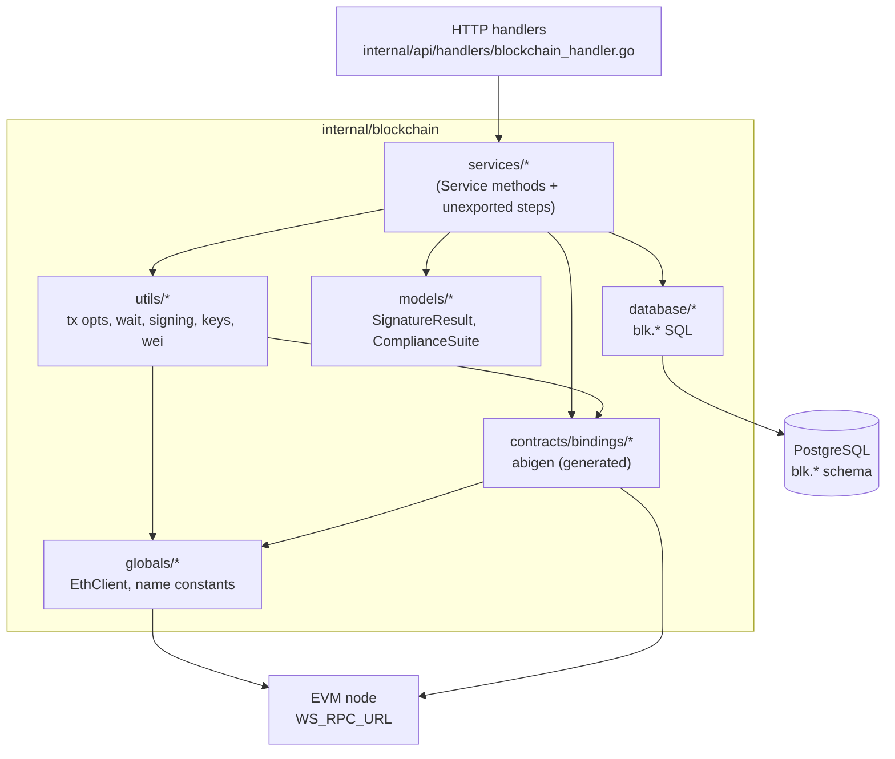
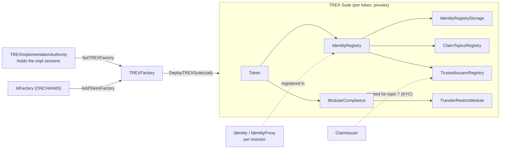
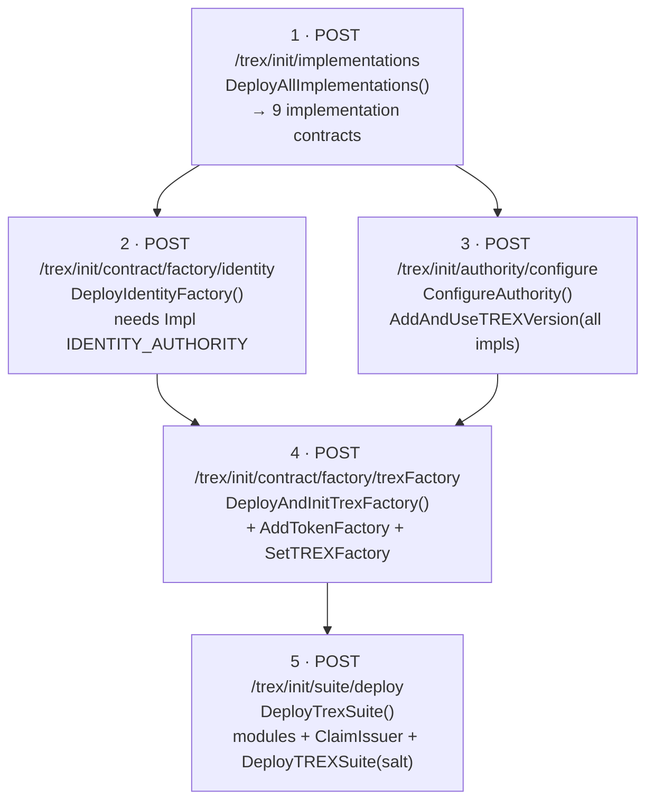
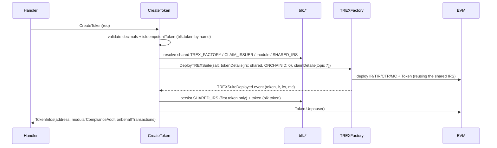
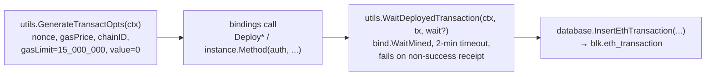

# Blockchain module (`internal/blockchain`)

This package is the on-chain engine of Tooken-Services. It deploys and operates an
[ERC-3643 / T-REX](https://docs.erc3643.org/) permissioned security-token
infrastructure on an EVM chain and exposes it to the rest of the API. T-REX makes
tokens *permissioned*: only wallets that carry a verified on-chain **Identity**
(ONCHAINID) with the required **claims** (e.g. KYC) can hold or receive tokens, and
every transfer is checked by a **ModularCompliance** contract.

The module never talks to end users directly. HTTP handlers in
`internal/api/handlers/blockchain_handler.go` call the exported `*Service` methods
documented here; long-running deployments run asynchronously and return `202`.

---

## 1. Responsibilities at a glance

| Concern | Where |
|---|---|
| Smart-contract Go bindings (abigen, **generated**) | `contracts/bindings/` |
| Business logic / orchestration | `services/` |
| Persistence (raw SQL, `blk.*` schema) | `database/` |
| Plain Go domain structs | `models/` |
| Signing, gas, encoding, unit conversion helpers | `utils/` |
| Eth client + contract-name constants + mutable address cache | `globals/` |

### Directory layout

```
internal/blockchain/
├── contracts/bindings/      # 1 generated .go per Solidity contract (DO NOT EDIT)
│   ├── Token.go  TokenProxy.go  Identity.go  IdentityProxy.go  IdFactory.go
│   ├── IdentityRegistry.go  IdentityRegistryStorage.go  ClaimIssuer.go
│   ├── ClaimTopicsRegistry.go  TrustedIssuersRegistry.go  ModularCompliance.go
│   ├── ModularComplianceProxy.go  TransferRestrictModule.go
│   ├── TREXFactory.go  TREXImplementationAuthority.go  ImplementationAuthority.go
├── services/                # all .go are package `services`, one *Service receiver
├── database/                # package `database`, raw SQL over globals.DB
├── models/                  # SignatureResult, ComplianceSuite, ComplianceModule
├── utils/                   # GenerateTransactOpts, WaitDeployedTransaction, keys, ...
└── globals/                 # EthClient, contract-name constants, address cache
```

All service files share a single `Service` struct (`services/services.go`,
`NewService()`); it is **stateless** — methods receive everything they need via
arguments and globals.

---

## 2. Architecture & layering



**Read the dependency edges as the contract for new code:** services orchestrate;
they reach the chain through `bindings` + `globals.EthClient`, sign through
`utils`, and persist through `database`. `database` and `bindings` never call back
into `services`.

---

## 3. The T-REX object model (what gets deployed)



Most concrete contracts are **proxies** pointing at shared *implementations*; the
`TREXImplementationAuthority` is the single source of truth for which
implementation version every proxy uses.

---

## 4. Platform bootstrap (one-time, ordered)

These five endpoints must be called in order; each step consumes addresses
produced by earlier ones. Steps 1, 4 and 5 are asynchronous (`202`).



Step 1 (`services/implementation_contracts.go`) deploys, in this exact order:
`ClaimTopicsRegistry`, `TrustedIssuersRegistry`, `IdentityRegistryStorage`,
`IdentityRegistry`, `ModularCompliance`, `Token`, `Identity`,
`ImplementationAuthority` (for identities), and `TREXImplementationAuthority`
(reference, `isReference=true`).

Step 5 (`services/TREX_factory.go → DeployTrexSuite`) hard-codes the first suite:
name `TREXSuiteV1`, symbol `TOOK`, 18 decimals, compliance = `TransferRestrictModule`,
claim topic `7` (KYC), salt `TookenSuiteV1Salt`. It waits on the
`TREXSuiteDeployed` event rather than the tx receipt.

> ⚠️ **Operational gotcha:** the config tables `blk.contract_role`,
> `blk.contract_implementation` and `blk.contract_instance` are *read* during
> bootstrap (e.g. `GetContractRoleByName(IDENTITY_FACTORY)`,
> `GetImplementationContractByName(...)`) but the corresponding **inserts are
> currently commented out / `TODO`** in the deploy functions. In the current state
> these tables must be populated out-of-band for steps 2–5 to resolve addresses.
> See [§8 Known gaps](#8-known-gaps--caveats).

---

## 5. Runtime operations (per investor / per token)

### 5.1 Create an investor Identity — `CreateIdentity` (`services/identity.go`)

`POST /contract/identity`

1. Idempotency via `GetWalletByUserId` (**currently mocked**, always returns an
   address ⇒ effectively short-circuits — see §8).
2. `GenerateNewWallet` — generate an ECDSA keypair, persist it to `blk.user_wallet`.
3. `deployIdentityProxy` — deploy an `IdentityProxy` against the identity
   implementation authority.
4. `registerIdentity` — `IdentityRegistry.RegisterIdentity(wallet, identity, country)`.
5. `InsertIdentity` into `blk.identity`.

### 5.2 Add a claim — `AddClaimToIdentity` (`services/identity_claim.go`)

`POST /contract/identity/claims/add`

Looks up the user's Identity (`blk.identity`), builds an ERC-734/735 signature off
the platform `PRIVATE_KEY` (`generateSignatureAddClaim`: abi-encode
`address,uint256,bytes` → keccak256 → `\x19Ethereum Signed Message` → `crypto.Sign`),
then `Identity.AddClaim(topic, scheme=1, issuer=CLAIM_ISSUER, signature, "OK", "")`.
Claim payload data is the constant string `"OK"`.

### 5.3 Create a Token (standalone path) — `CreateToken` (`services/token.go`)

`POST /contract/token`. Distinct from `DeployTrexSuite`: it assembles a token by
hand against an **existing** `IdentityRegistry` instance read from
`blk.contract_instance`.



`CreateToken` goes through the **shared `TREXFactory`** (canonical T-REX path), not a
hand-wired proxy. It reuses the shared infrastructure — one factory, one
`ClaimIssuer`, one manager (`ethFrom`), and one **IRS** (so the investor whitelist is
shared across all tokens) — while the factory deploys a per-token IR/TIR/CTR/MC wired
to that shared issuer/topic/IRS. The token ONCHAINID is created by the factory
(`ONCHAINID: 0`). The token is deployed **paused**; `unpauseToken` enables transfers.
The sub-transactions are returned as `OnbehalfTransactions`.

### 5.4 Mint / Burn — `Mint`, `Burn` (`services/mint_token.go`, `burn_token.go`)

`POST /contract/token/mint` and `/contract/token/burn` (both async `202`).
Look up the token in `blk.token` for its decimals, validate inputs
(`controlInputMintBurn` + `IsHexAddress`), convert the human amount to wei with
`utils.ConvertFloatToWei` (shopspring/decimal), then call `Token.Mint` / `Token.Burn`.
Handlers run these in a goroutine with `context.WithoutCancel` so the work outlives
the HTTP request.

---

## 6. Cross-cutting conventions

### 6.1 The transaction lifecycle (every write follows it)



- The boolean arg to `WaitDeployedTransaction` is `shouldWaitContractReturn`: pass
  `true` for **deployments** (it then polls `CodeAt` up to 10× to confirm bytecode
  is live), `false` for plain method calls.
- Suite deployment is the exception: `WaitTREXSuiteDeployment` subscribes to the
  `TREXSuiteDeployed` event (`salt`-filtered, 2-min timeout) because the resulting
  addresses come from the event, not the receipt.
- Logging uses the project `pkg/logger` with emoji prefixes (💌 sending, 📬 mined,
  ✅ done). This is the house style — keep it for consistency.

### 6.2 Signing & keys (`utils/keys_utils.go`)

- **One platform signer for everything.** `PRIVATE_KEY` (hex) is the deployer,
  owner and agent of every contract. `GetEthFrom()` derives its address.
- Investor wallets are generated server-side (`GenerateNewWallet`) and stored in
  `blk.user_wallet`.
- `EncryptAESGCM` exists for wallet keys but uses a hard-coded AES key (tracked in
  issue #12) and the column `private_key_clear` is also persisted — see §8.

### 6.3 Address resolution

Services never hard-code addresses. They resolve them by **contract-name
constant** (`globals/constants.go`, e.g. `ImplTokenName`, `IdentityFactoryName`,
`TrexFactoryName`, `ClaimIssuerName`, `TransferRestrictionModuleName`) through one
of three lookups:

| Table | Reader | Meaning |
|---|---|---|
| `blk.contract_implementation` | `GetImplementationContractByName` / `GetAllContractImplementations` | shared logic impls |
| `blk.contract_role` | `GetContractRoleByName` | singletons by role (factory, claim issuer, module) |
| `blk.contract_instance` | `GetContractInstanceByName` | concrete proxy instances |

`utils.FindContractByName` filters an in-memory `[]server.ContractDetails` slice.

### 6.4 Units & types

Token amounts cross the boundary as `float64` (human) → `*big.Int` (wei) via
`utils.ConvertFloatToWei(amount, decimals)`. Never send raw floats on-chain.

---

## 7. Persistence (`blk.*` schema) & API surface

Tables touched by this module:

| Table | Written by | Read by |
|---|---|---|
| `blk.eth_transaction` | every operation (`InsertEthTransaction`) | — |
| `blk.user_wallet` | `InsertWallet` | `GetWalletByUserId` *(mocked)* |
| `blk.identity` | `InsertIdentity` | `GetIdentityAddrByUserId` |
| `blk.token` | `InsertToken` | `GetTokenByName`, `GetTokenByAddress` |
| `blk.contract_implementation` | *(TODO — commented out)* | impl lookups |
| `blk.contract_role` | `InsertContractRole` (factory, claim issuer, module, shared IRS) | `GetContractRoleByName` |
| `blk.contract_instance` | *(TODO)* | instance lookups |

Endpoints → service methods (all under `globals.BaseURL` = `/api/v1`):

| Method & path | Handler | Service |
|---|---|---|
| `POST /trex/init/implementations` | `DeployAllImplementationsAsync` | `DeployAllImplementations` |
| `POST /trex/init/contract/factory/identity` | `DeployIdentityFactory` | `DeployIdentityFactory` |
| `POST /trex/init/authority/configure` | `ConfigureAuthority` | `ConfigureAuthority` |
| `POST /trex/init/contract/factory/trexFactory` | `DeployAndInitTrexFactoryAsync` | `DeployAndInitTrexFactory` |
| `POST /trex/init/suite/deploy` | `DeployTrexSuiteAsync` | `DeployTrexSuite` |
| `GET  /trex/suite` | `GetTrexSuiteInfos` | *(stub)* |
| `POST /contract/identity` | `CreateIdentity` | `CreateIdentity` |
| `POST /contract/identity/claims/add` | `AddClaimToIdentity` | `AddClaimToIdentity` |
| `POST /contract/token` | `CreateTokenContract` | `CreateToken` |
| `GET  /contract/token/{tokenAddress}/infos` | `GetTokenInfos` | *(stub)* |
| `POST /contract/token/mint` | `MintTokenAsync` | `Mint` |
| `POST /contract/token/burn` | `BurnTokenAsync` | `Burn` |

These routes are **not** marked `bearerAuth` in `api/openapi.yaml`, so they are
currently public (auth is spec-driven — see the repo `copilot-instructions.md`).

### Environment variables

| Var | Used by | Purpose |
|---|---|---|
| `WS_RPC_URL` | `services/blockchain.go` | EVM node endpoint (`ethclient.Dial`) |
| `PRIVATE_KEY` | `utils/keys_utils.go`, `identity_claim.go` | platform signer (hex, `0x` optional) |

`globals.EthClient` is initialised once in `main.go` via `SetupEthClient()`.

---

## 8. Known gaps & caveats

These are real, present in the code today — keep them in mind before relying on the
module or extending it.

- **Config tables only partially auto-populated.** Singleton roles (TREX factory,
  claim issuer, compliance module, shared IRS) are now persisted to
  `blk.contract_role` via `InsertContractRole` at their creation sites, and created
  tokens to `blk.token` via `InsertToken`. However `blk.contract_implementation` and
  `blk.contract_instance` inserts are still `TODO`/commented (e.g. the
  `IDENTITY_REGISTRY` instance read by `CreateIdentity` is not written), so those rows
  must still be seeded manually.
- **`GetWalletByUserId` is mocked** (`wallet_db.go`) — returns `common.MaxAddress`,
  so `CreateIdentity`'s idempotency check never sees "no wallet".
- **Key handling.** A single `PRIVATE_KEY` signs everything; generated wallet keys
  are stored as `private_key_clear` (plaintext) and the AES helper uses a hard-coded
  key (issue #12). Treat as pre-production.
- **`SetGlobals`** (`services/globals.go`) is a stub and its call site in `main.go`
  is commented out, so the mutable address cache in `globals` is never warmed.
- Several handlers (`GetTrexSuiteInfos`, `GetTokenInfos`) and DB readers
  (`GetTrexSuite`, `GetTREXFactoryAddress`) are stubs returning empty/`not implemented`.
- `contracts/bindings/*` are abigen-generated — regenerate from the Solidity
  sources, never hand-edit.
